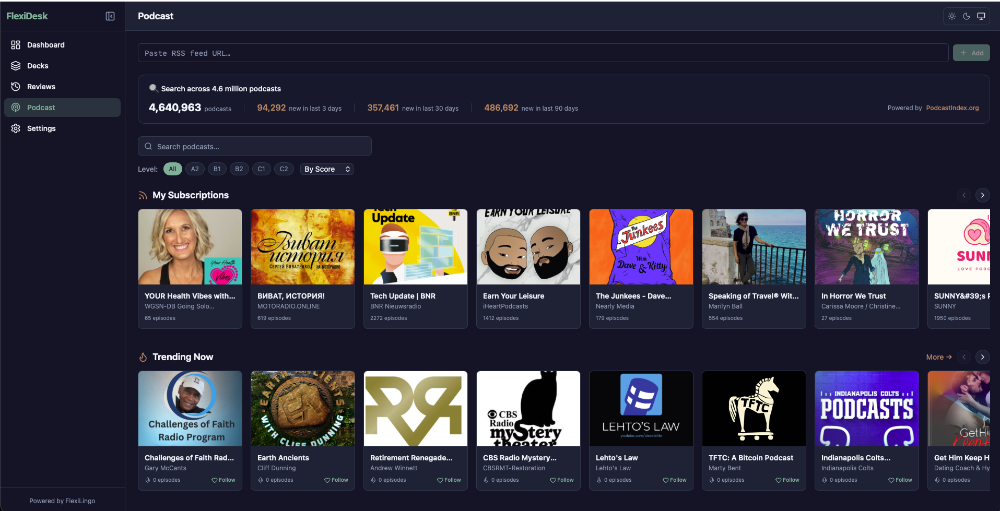
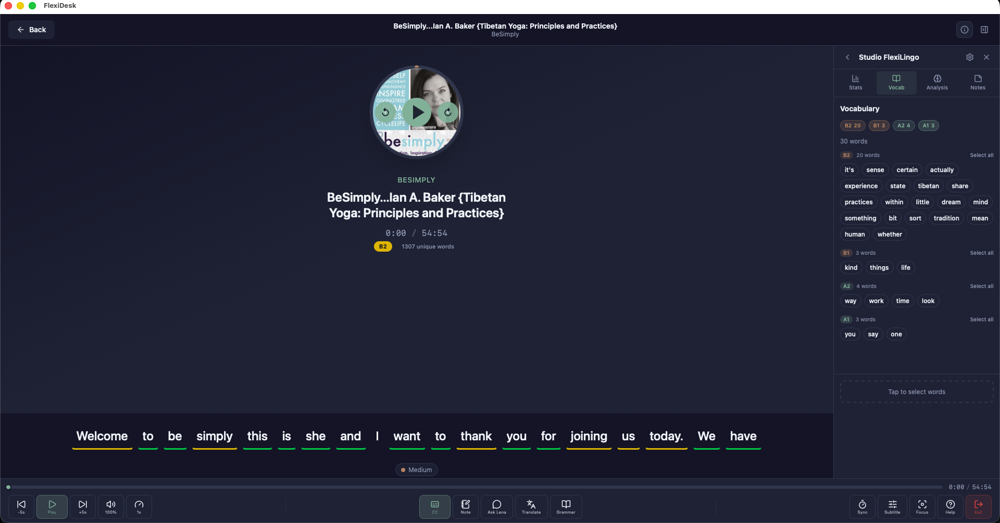

<p align="center">
  
</p>

<h1 align="center">FlexiDesk</h1>

<p align="center">
  <strong>Open-source, offline-first desktop language learning workstation</strong>
</p>

<p align="center">
  <a href="#features">Features</a> &bull;
  <a href="#installation">Installation</a> &bull;
  <a href="#development">Development</a> &bull;
  <a href="#architecture">Architecture</a> &bull;
  <a href="#contributing">Contributing</a> &bull;
  <a href="#license">License</a>
</p>

---

[**FlexiLingo**](https://flexilingo.com) is an AI-powered language learning platform with apps across browser extension, mobile, desktop, and web. **FlexiDesk** is the desktop app in this ecosystem — designed to work **fully offline** with local AI.

FlexiDesk combines learning modules — from podcast listening to AI-powered tutoring — into a single app. All AI runs locally on your machine via [Ollama](https://ollama.com) — no account, no subscription, no data leaves your computer.

Built with [Tauri 2](https://v2.tauri.app/) (Rust) and React 19. Fast, lightweight (~15 MB), works on macOS, Windows, and Linux.

<p align="center">
  
</p>

<p align="center">
  
</p>

## Features

- **Podcast Player** — Subscribe to RSS feeds, download episodes, transcribe with local [whisper.cpp](https://github.com/ggerganov/whisper.cpp), click any word for instant AI translation and grammar analysis
- **Ask Lena** — AI sentence assistant built into the podcast player. Translates sentences, explains grammar, and gives learning tips — all in your native language
- **SRS Review** — Spaced repetition flashcards with three algorithms (Leitner, SM-2, FSRS). Create decks, merge, bulk import
- **Dashboard** — Track your learning with XP chart, streak calendar, CEFR radar, study heatmap, vocabulary timeline, and daily goals
- **100% Offline AI** — All AI features run locally via [Ollama](https://ollama.com). No cloud, no account, no data sent anywhere
- **One-Click Setup** — Install Ollama and Whisper directly from the app. No terminal needed
- **10+ Languages** — English, Persian, Arabic, Turkish, Spanish, French, German, Chinese, Hindi, Russian
- **Dark/Light/System** theme with RTL support for Arabic and Persian

## Roadmap

These modules are built and under testing. They'll be enabled in upcoming releases:

- **AI Tutor** — Conversation practice with local AI, grammar correction, 10 role-play scenarios
- **Vocabulary Manager** — Central word manager with CEFR filtering, CSV/Anki export
- **Live Caption** — Real-time speech-to-text from microphone using local Whisper
- **Writing Coach** — AI-graded essay writing (IELTS, TOEFL, Cambridge, etc.)
- **Reading Mode** — Import texts, highlight words, build vocabulary
- **Pronunciation** — Record and compare with Whisper transcription
- **Exam Practice** — Timed mock exams with scoring

## Installation

### Pre-built Binaries

Download the latest release for your platform from the [Releases](../../releases) page:

| Platform | Format |
|----------|--------|
| macOS | `.dmg` (Universal — Intel + Apple Silicon) |
| Windows | `.msi` installer |
| Linux | `.AppImage`, `.deb` |

### Build from Source

**Prerequisites:**
- [Node.js](https://nodejs.org/) 22+
- [pnpm](https://pnpm.io/) 9+
- [Rust](https://rustup.rs/) (stable)
- Platform-specific dependencies (see below)

```bash
# Clone the repo
git clone https://github.com/flexilingo/Flexi-Desk.git
cd Flexi-Desk

# Install frontend dependencies
pnpm install

# Run in development mode
pnpm tauri dev

# Build for production
pnpm tauri build
```

#### Linux Dependencies

```bash
sudo apt-get install -y \
  libwebkit2gtk-4.1-dev \
  libappindicator3-dev \
  librsvg2-dev \
  patchelf \
  libasound2-dev
```

## Development

```bash
pnpm tauri dev      # Start dev server + Tauri window
pnpm lint           # ESLint
pnpm format:check   # Prettier check
pnpm test           # Vitest
```

The app uses hot-reload for the React frontend. Rust changes require a restart.

### Environment Setup

FlexiDesk works fully offline out of the box. For optional cloud features (sync, AI cloud providers, OAuth login), copy `.env.example` to `.env` and fill in the values:

```bash
cp .env.example .env
```

## Architecture

```
flexi-lingo-desk/
├── src/                          # React 19 frontend
│   ├── components/layout/        # Shell, Sidebar, Header
│   ├── components/ui/            # Radix UI primitives (Card, Button, Dialog, etc.)
│   ├── hooks/                    # useTheme, useShortcuts, useDirection
│   ├── stores/                   # Zustand + Immer (appStore, authStore, syncStore, shortcutStore)
│   ├── pages/
│   │   ├── dashboard/            # Analytics, goals, achievements, streak
│   │   ├── podcast/              # Feed management, player, transcription
│   │   ├── review/               # SRS decks, flashcard sessions
│   │   ├── reading/              # Document import, highlights
│   │   ├── tutor/                # AI conversations, scenarios
│   │   ├── caption/              # Live audio capture, Whisper
│   │   ├── pronunciation/        # Recording, analysis
│   │   ├── writing/              # Sessions, prompts, corrections
│   │   ├── exam/                 # Templates, timed sessions
│   │   ├── vocabulary/           # Word management, bulk ops
│   │   └── settings/             # Account, AI, languages, shortcuts, appearance
│   └── lib/                      # Utilities, supabase wrapper
├── src-tauri/                    # Rust backend
│   ├── src/
│   │   ├── ai/                   # Shared AI provider (Ollama/OpenAI/Anthropic), prompts, JSON extractor
│   │   ├── auth/                 # Optional auth (OTP via Supabase)
│   │   ├── caption/              # CPAL audio capture, Whisper sidecar
│   │   ├── commands/             # Tauri IPC command handlers (18 modules)
│   │   ├── dashboard/            # Analytics, streaks, XP, achievements
│   │   ├── db/                   # SQLite schema + versioned migrations (V001-V022)
│   │   ├── ollama/               # Ollama installer, process manager, model client
│   │   ├── podcast/              # RSS parsing, download, transcription
│   │   ├── srs/                  # Leitner, SM-2, FSRS algorithms
│   │   └── ...                   # reading, tutor, writing, exam, pronunciation, export
│   └── Cargo.toml
└── .github/workflows/            # CI (lint + build) + Release (auto-publish)
```

### Tech Stack

| Layer | Technology |
|-------|-----------|
| Framework | [Tauri 2](https://v2.tauri.app/) |
| Frontend | React 19, TypeScript, Vite 7 |
| State | Zustand 5 + Immer |
| UI Components | Radix UI + CVA |
| Styling | Tailwind CSS v4 (`@theme` directive) |
| Charts | Recharts |
| Routing | React Router v7 |
| i18n | react-i18next |
| Backend | Rust (stable) |
| Database | SQLite via rusqlite (bundled) |
| Audio | CPAL (system audio capture) |
| Speech-to-Text | Whisper (local, via sidecar binary) |
| Local AI | [Ollama](https://ollama.com) — auto-installed, supports llama3.2, mistral, gemma, qwen, etc. |
| Auth | OTP email login (optional, via Supabase) |

### Data Flow

```
React Component → Zustand Store → invoke<T>() → Tauri Command → Rust → SQLite
                                                                    ↓
                                                              supabaseCall() → Edge Functions (optional)
```

All data is stored locally in SQLite. The `Raw*` types (snake_case from Rust) are mapped to camelCase TypeScript types via mapper functions in each module's `types.ts`.

## Contributing

See [CONTRIBUTING.md](CONTRIBUTING.md) for architecture details, how to add a new module, code style, and PR guidelines.

## License

This project is licensed under the [GNU Affero General Public License v3.0](LICENSE) — see the LICENSE file for details.

**Why AGPL?** We want FlexiDesk to remain free and open. The AGPL ensures that modifications and derivative works are also shared with the community, even when deployed as a service.

---

<p align="center">
  Built with Tauri, Rust, and React<br/>
  Part of the <a href="https://flexilingo.com">FlexiLingo</a> ecosystem
</p>
