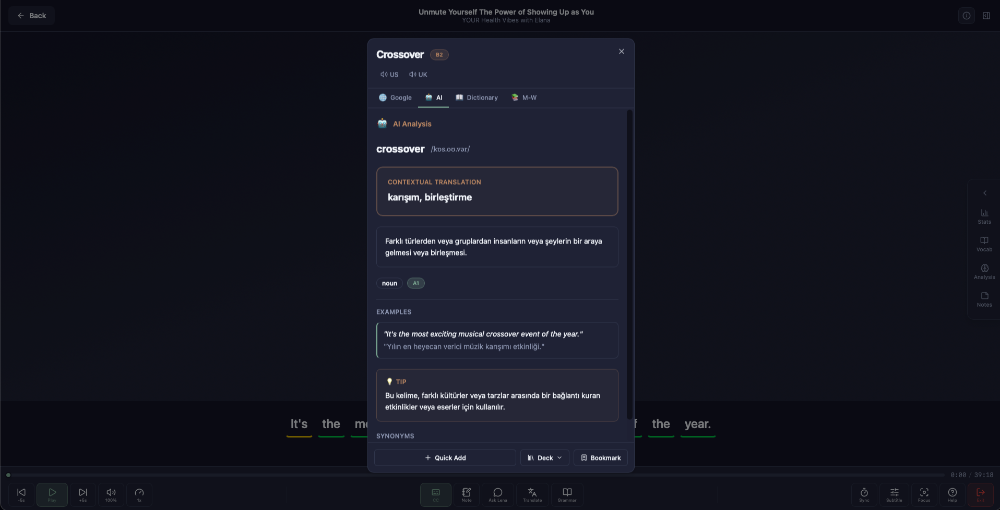

<div align="center">
  <a name="readme-top"></a>

  

  <h1>FlexiLingo Desk</h1>

  Offline-first desktop learning companion — podcasts, SRS review, AI tutor, live caption, and more.

  [![Release][release-badge]][releases-url] [![Website][website-badge]][website-url]

  [Download][releases-url] · [Website][website-url] · [Report Bug][issues-url]

</div>

---

<p align="center">
  <a href="docs/screenshot.png"></a>
  <a href="docs/screenshot2.png"></a>
  <a href="docs/screenshot3.png"></a>
</p>

---

## ✨ Features

Built with **Tauri 2 + Rust** on the backend and **React 19** on the frontend. All data lives in a local **SQLite** database and syncs to the cloud when online.

| Module | Version | Status | Description |
| :--- | :---: | :---: | :--- |
| 🎧 Podcast Player | v1.0 | ✅ Stable | PodcastIndex + RSS, Whisper transcription, CEFR subtitles, word lookup |
| 🧠 SRS Review | v1.0 | ✅ Stable | Spaced repetition with Leitner, SM-2, and FSRS algorithms |
| 📊 Dashboard | v1.0 | ✅ Stable | XP, streaks, daily stats, learning overview |
| ⚙️ Settings | v1.0 | ✅ Stable | Theme, language, AI provider, Whisper model management |
| 🎙 Caption | v1.0-beta | 🧪 Beta | Live audio capture + real-time Whisper transcription |
| 🤖 AI Tutor | v1.0-beta | 🧪 Beta | Voice conversation partner with 63 scenarios, 5 practice modes, searchable role-plays, deck practice, and session scoring |
| 📖 Reading | — | 🔄 Planned | Import PDF, EPUB, URLs with highlights and vocabulary |
| 🗣 Pronunciation | — | 🔄 Planned | Speech analysis and feedback |
| 📝 Writing | — | 🔄 Planned | Writing exercises with AI feedback |
| 📚 Vocabulary | — | 🔄 Planned | Personal word list across all modules |
| 📋 Exam | — | 🔄 Planned | Quiz and exam creation |

## 🖥 Platform Support

| [][releases-url]<br>macOS | [][releases-url]<br>Windows | [][releases-url]<br>Linux |
| :---: | :---: | :---: |
| macOS 12+ | Windows 10+ | Ubuntu 20.04+ |

## 📥 Download

Download the latest release for your OS from the [Releases page][releases-url].

## 🏗 Architecture

FlexiLingo Desk is **offline-first** — built with **Tauri 2 (Rust)** and **React 19**. All data lives in a local SQLite database and syncs to the cloud when online.

## 🌍 Language Support

| Language | Code | Transcription | CEFR + NLP |
| :--- | :---: | :---: | :---: |
| 🇬🇧 English | `en` | ✅ | ✅ |
| 🇪🇸 Spanish | `es` | ✅ | ✅ |
| 🇫🇷 French | `fr` | ✅ | ✅ |
| 🇩🇪 German | `de` | ✅ | ✅ |
| 🇨🇳 Chinese | `zh` | ✅ | ✅ |
| 🇸🇦 Arabic | `ar` | ✅ | ✅ |
| 🇮🇷 Persian | `fa` | ✅ | ✅ |
| 🇹🇷 Turkish | `tr` | ✅ | ✅ |
| 🇮🇳 Hindi | `hi` | ✅ | ✅ |
| 🇷🇺 Russian | `ru` | ✅ | ✅ |

## 🤖 AI Models

| Layer | Model | Purpose |
| :--- | :--- | :--- |
| Transcription | Whisper `turbo` | ~98% accuracy, ~12 min/hr of audio |
| Transcription fallback | Whisper `small` | Degraded mode |
| NLP | spaCy | POS tagging, collocations, dependency parsing |
| LLM | GPT-4o-mini | Tutor conversations, AI feedback |

## 🌐 FlexiLingo Ecosystem

FlexiLingo Desk is part of a larger platform available on **Web**, **Mobile**, **Browser Extension**, and **Desktop**. Learn more at [flexilingo.com][website-url].

## 🧪 Development

### Prerequisites

- [Rust](https://rustup.rs/) 1.77+
- [Node.js](https://nodejs.org/) 20+
- [Tauri CLI](https://tauri.app/start/prerequisites/) v2

### Build & Run

```bash
# Install frontend dependencies
npm install

# Run in development mode
npm run tauri dev

# Build for production
npm run tauri build
```

### Tests

The Rust backend has **214 unit tests** covering all pure-logic modules (SRS algorithms, sync queue, analytics, NLP, export/import, tutor, plugins, and more).

```bash
# Run all backend unit tests
cd src-tauri && cargo test --lib

# Run tests for a specific module
cargo test --lib srs::leitner
cargo test --lib srs::sm2
cargo test --lib sync::queue
cargo test --lib dashboard::analytics
```

All tests run offline with no external dependencies (in-memory SQLite, temp files).

## 🔗 Links

- [Download Releases][releases-url]
- [FlexiLingo Website][website-url]
- [Report a Bug][issues-url]

---

[release-badge]: https://img.shields.io/github/v/release/flexilingo/Flexi-Desk?style=flat-square&label=release&color=6B705C
[releases-url]: https://github.com/flexilingo/Flexi-Desk/releases
[website-badge]: https://img.shields.io/badge/website-flexilingo.com-6B705C?style=flat-square
[website-url]: https://www.flexilingo.com
[issues-url]: https://github.com/flexilingo/Flexi-Desk/issues
